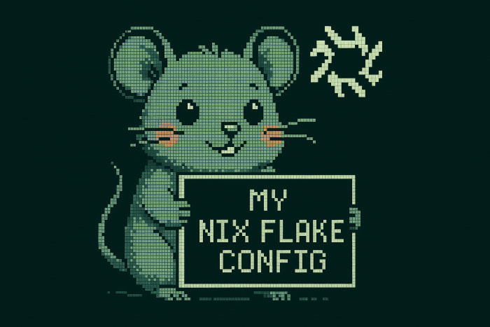

### ❄️ My Nix Flake Repository 🚧

This repo contains my complete system configuration for a declarative, reproducible, and minimal NixOS setup — tailored for daily development, Kubernetes home-ops, WSL2 integration, and soothing Catppuccin-based fish shell theming.


## ✨ Features

- ❄️ **Nix flakes**: Modular, composable, version-locked
- 🐟 **Fish shell**: Minimal `fish` shell setup with soothing `Catppuccin` colours and a `Starship` prompt.
- 🔐 **Secrets management**: Secrets encrypted and managed with `sops-nix`
- 🧰 **WSL2-friendly**: Tested extensively in Windows Subsystem for Linux
- 🧪 **Development modules**: Streamlined development environments for multiple languages and tools
- 🧩 **Custom packages**: Custom `nixpkgs` overlays and pkgs managed declaratively


## 🧩 Structure

```bash
.
├── flake.nix          # Entrypoint for all modules and inputs
├── flake.lock         # Locked dependencies
├── homes/
│   └── _modules       # Home-manager modules
│   └── {username}     # User-specific configuration
├── hosts/
│   └── _modules       # Shared nixos-modules
│   └── {hostname}     # Host-specific configuration
├── lib/               # Utility functions
├── overlays/          # Custom overlays
└── pkgs/              # Custom packages

```

## 📚 References

Built on the shoulders of those who came before me

- [bjw-s nix-config](https://github.com/bjw-s/nix-config)
- [billimek dotfiles](https://github.com/billimek/dotfiles)
- [Misterio77/nix-starter-config](https://github.com/Misterio77/nix-starter-configs)


## 🧊 Powered by

Built with love, flakes and frustration. ♥
